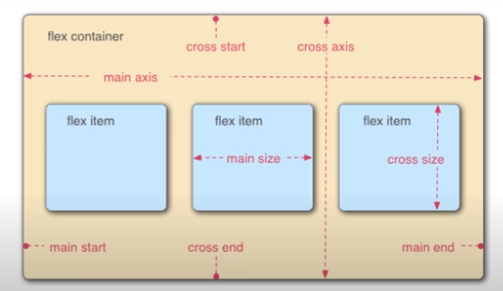
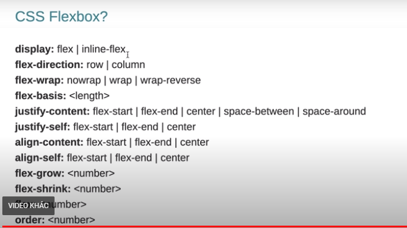
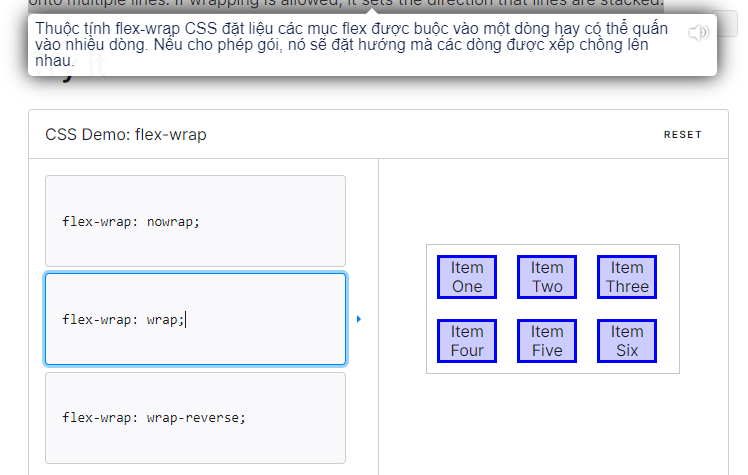

### Bố cục

### các css của flexbox

#### css justify-content

- display: flex ( đưa các item con theo chiều main axis --theo chieu ngang)
- justify-content: space-between / đẩy item cách ra xa ####cách này <=>
```[
    /* Cách này */
/* .nav-list:nth-child(1) {
  margin-right: auto;
} */

/* Hoặc cách này */
/* .nav-list:nth-child(2) {
  margin-left: auto;
} */

]
``` 
với display :flex
- flex: 1; all các item có cùng chiều dài( flex: flex-grow flex-shrink flex-basis|auto|initial|inherit;)// vd như ô input trong vd flexbox
- flex direction: 
```
Hướng của trục chính được xác định bởi thuộc tính flex-direction có thể có bốn giá trị:

flex-direction: row; – trục chính chạy từ trái sang phải (mặc định)
flex-direction: row-reverse; – trục chính chạy từ phải sang trái
flex-direction: column; – trục chính chạy từ trên xuống dưới
flex-direction: column-reverse; – trục chính chạy từ dưới lên trên
```
- flex basic : là xác định chiều rộng cuat flexitem (cùng chiều với main axis)
- justify content: space around (khoảng cách lề =1/2 giữa)
space between (không có khoảng cách lề) scpace evenly(khoảng cách đều nhau)
- align-items: (đổi chiều của cross axis) mặt định flex-star
có thể đổi ngược lại flex-end <====> thuộc tính dùng cho item con có tính chất tương tự align self:
- order: thay doi thu tu flex-item . nhỏ nhất ở main star lớn main end
- thuôc tính reveser đổi chiu (row reveser )


### một số cách tự động căn giữa div trong 1div lớn của trang:
```
cho 1 max-width:...
 margin: trên có gtri, phải auto, dưới 0 (tuỳ), trái auto;
 // vd trong bài vd flexbox
 ```
 - flex wrap
 
